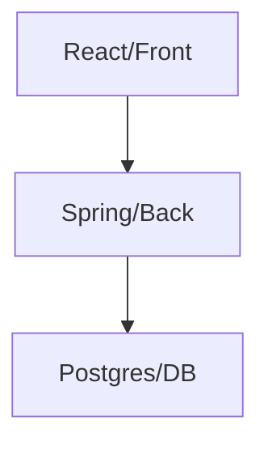

# Front Gestao Beneficios

Este é o frontend da parte da Gestão de Benefícios do projeto de RPPS

## Tecnologias Utilizadas

Foram utilizadas as seguintes tecnologias:
- React
- Vite.js
- Typescript

## Estrutura do projeto



## Rodar o projeto e observações

Por problemas tecnicos ainda não há um Docker funcional para esta parte do projeto, por isso para rodar o frontend use: 
```
  npm run dev
```

Sendo a porta do projeto no *5300*
